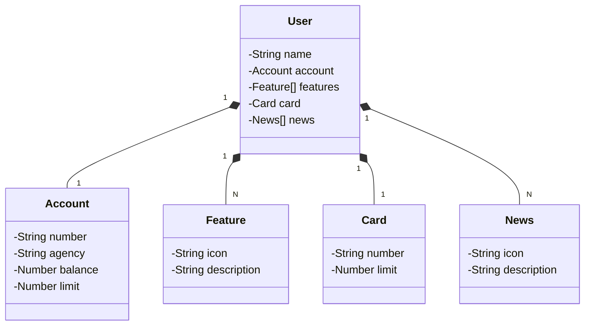

# Santander Dev Week 2023

Java RESTful API criada para a Santander Dev Week.

A API foi desenvolvida para fornecer um serviço de gerenciamento de usuários, contas bancárias, cartões e recursos adicionais. Ela é baseada em tecnologias modernas e segue as melhores práticas de desenvolvimento.

## Principais Tecnologias
 - **Java 17**: A versão LTS mais recente do Java para tirar vantagem das últimas inovações que essa linguagem robusta e amplamente utilizada oferece;
 - **Spring Boot 3**: A mais nova versão do Spring Boot, que maximiza a produtividade do desenvolvedor por meio de sua poderosa premissa de autoconfiguração;
 - **Spring Data JPA**: Foi explorado como essa ferramenta pode simplificar nossa camada de acesso aos dados, facilitando a integração com bancos de dados SQL;
 - **OpenAPI (Swagger)**: Foi criado uma documentação de API eficaz e fácil de entender usando a OpenAPI (Swagger), perfeitamente alinhada com a alta produtividade que o Spring Boot oferece;
 - **Railway**: Foi utilizado para facilitar o deploy e monitoramento de nossas soluções na nuvem, além de oferecer diversos bancos de dados como serviço e pipelines de CI/CD.

## [Link do Figma](https://www.figma.com/file/0ZsjwjsYlYd3timxqMWlbj/SANTANDER---Projeto-Web%2FMobile?type=design&node-id=1421%3A432&mode=design&t=6dPQuerScEQH0zAn-1)

O Figma foi utilizado para a abstração do domínio desta API, sendo útil na análise e projeto da solução.

## [Acesso à API](https://sdw-2023-api-matheusvidal.up.railway.app/swagger-ui/index.html#/)

A API está disponível para teste e acesso através do seguinte link, que foi implantado usando o Railway:
[https://sdw-2023-api-matheusvidal.up.railway.app/swagger-ui/index.html#/](https://sdw-2023-api-matheusvidal.up.railway.app/swagger-ui/index.html#/)

Certifique-se de utilizar essa URL para acessar a API e testar suas funcionalidades. O Railway tornou o processo de implantação e hospedagem simples e eficiente.

### Exemplos de Uso

Aqui estão alguns exemplos simples de como usar a API:

#### Recuperar um usuário por ID
```http
GET /users/{id}
```


#### Criar um novo usuário
```http
POST /users
Content-Type: application/json

{
  "name": "Nome do Usuário",
  "account": {
    "number": "12345",
    "agency": "67890",
    "balance": 1000.00,
    "limit": 500.00
  },
  "card": {
    "number": "9876543210",
    "limit": 2000.00
  }
}
```

## Funcionalidades da API
- **`GET /users/{id}:`**  Este endpoint permite a recuperação de informações sobre um usuário específico com base no ID fornecido. Ao acessar este endpoint com um ID válido, a API retornará os detalhes desse usuário.
- **`POST /users:`** Este endpoint é usado para criar um novo usuário. Os detalhes do novo usuário são fornecidos no corpo da solicitação em formato JSON. Após a criação bem-sucedida, a API retornará os detalhes do usuário recém-criado, juntamente com um cabeçalho Location que contém o URL para acessar as informações completas desse usuário.
Esses são os principais endpoints fornecidos pelo UserController para gerenciamento de usuários na sua API.

## Diagrama de Classes (Domínio da API)




